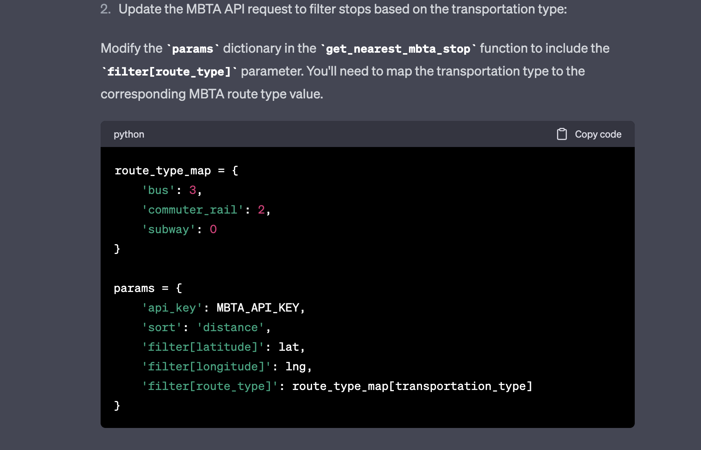
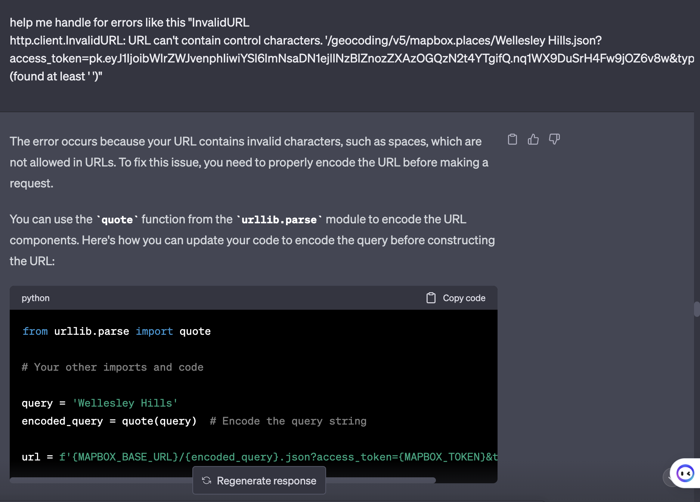

# MBTA Helper Project

## Team Members
- Member 1
- Member 2
- Member 3

## 1. Project Overview
In this project, I built a simple web application using Flask and Python to help users find the nearest MBTA stop to their location. Our application allows users to input a place name or address and select their preferred mode of transportation (bus, commuter rail, or subway). The application then returns the nearest MBTA stop and its wheelchair accessibility status. I also integrated real-time arrival data to suggest the optimal station to walk to and enabled filtering stops based on the chosen transportation type.

## 2. Reflection

### Process
  During this project, I successfully managed to set up a Flask web application and integrate it with the MBTA APIs. I was able to implement most of the features well , but I faced some challenges with error handling and styling. I could have improved our project scoping and testing by addressing these issues earlier on. In the future, we would allocate more time for planning and testing to ensure a smoother development process.

### Work Division
.

### Learning
Through this project, I learned the importance of effective communication, project management, and error handling.I also gained experience in using Flask and integrating it with external APIs. ChatGPT proved to be a valuable resource, providing guidance and code snippets whenever I faced difficulties. In hindsight, I wish we had a better understanding of Flask, HTML, and CSS, which could have made my development process smoother. I will use these learnings to improve our future projects.

### Screenshots

*adding transportation type *

*debugging an error*
